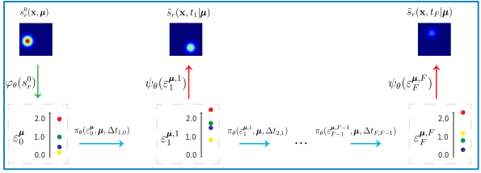

[](https://github.com/Aleartulon/AENODE/tree/structure/images/inference.svg)

# A Deep Learning approach for parametrized and time dependent Partial Differential Equations using Dimensionality Reduction and Neural ODEs
This repository contains the implementation of a Deep Learning methodology for solving **parametrized**,**time-dependent** and (typically) **nonlinear** Partial Differential Equations (PDEs) exploiting *dimensionality reduction* and *Neural ODEs*. The main idea of this method is that it is possible to map the high-fidelity (i.e., high-dimensional) PDE solution space into a reduced (low-dimensional) space, which subsequently exhibits dynamics governed by a (latent) Ordinary Differential Equation (ODE). 3 mathemcatical objects are approximated by Neural Networks(NNs):
1. An Encoder $\varphi_\theta$ which maps the (high-dimensional) solution field of the PDE into a (low-dimensional) reduced vector;
2. A Processor $\pi_\theta$ which advances in time, in the low-dimensional space, using known Runge-Kutta schemes the reduced vectors;
3. A Decoder $\psi_\theta$ which maps the (low-dimensional) reduced vector into the corresponding (high-dimensional) solution field of the PDE.
   
At testing time, the initial condition $s_r^0$ is mapped through the Encoder into its reduced representation $\varepsilon_{\pmb{\mu}}^0$. Subsequently, the full sequence of reduced vectors $\varepsilon^{\pmb{\mu},i}_i$ is recovered autoregressively by repeated application of the Processor. For each $\varepsilon^{\pmb{\mu},i}_i$, the corresponding PDE solution is recovered by application of the Decoder.

For a more detailed explanation of the methodology, please refed to this [paper](https://www.example.com).

##  Installation

```bash
# Clone the repository
git clone git@github.com:Aleartulon/AE_NODE.git

# Navigate into the project directory
cd AENODE

# Install dependencies
conda env create -f environment.yml
conda activate artu

# Run the application
python bin/main.py
```

##  Examples
In the directory [example_datasets](example_datasets/) there are a series of configs that can be used as examples. For instance by copying in [configs](configs/) the files [example_datasets/burgers_0.001/model_information.yaml](example_datasets/burgers_0.001/model_information.yaml) and  [example_datasets/burgers_0.001/initial_information.yaml](example_datasets/burgers_0.001/initial_information.yaml) one can train on the Burgers' case with $\nu=0.001$. 

To do so, **one needs to specify** in 'data_path' in [configs/initial_information.yaml](configs/initial_information.yaml) the path to the files 'field_step_training.npy', 'field_step_validation.npy', 'parameter_training.npy', 'parameter_validation.npy' which contain the training and validation data. More specifically, 'field_step_training.npy' must have dimensions $[N_{tr}, T, C, DX_1, DX_2, \ldots]$, 'field_step_validation.npy' must have dimensions $[N_{val}, T, C , DX1, DX2, ...]$, 'parameter_training.npy' must have dimensions $[N_{tr}, N_\mu+1]$ and 'parameter_training.npy' must have dimensions $[N_{val}, N_\mu+1]$, where $N_{tr}$ is the length of the training dataset,  $N_{val}$ is the length of the validation dataset, $T$ is the length of the time domain, $C$ is the number of channels of the solution field, $DX_1$ is the dimension of the first spatial dimension, $DX_2$ is the dimension of the second spatial dimension and so on, $N_\mu$ is the dimension of the parameter vector. In the parameter files, the second dimension is $N_\mu+1$ because in the last dimension the corresponding dt of the full time series is given (the dt is assumed constant across the full time series).


##  Project Structure
```plaintext
├── README.md
├── bin
│   └── main.py
├── configs
│   ├── initial_information.yaml
│   └── model_information.yaml
├── environment.yml
├── images
│   ├── inference.pdf
│   ├── inference.png
│   └── inference.svg
├── src
    ├── __init__.py
    ├── architecture.py
    ├── data_functions.py
    ├── method_functions.py
    └── training_validation_functions.py
```

## Contacts
For any information, you can contact Alessandro Longhi at a.longhi@tudelft.nl .

