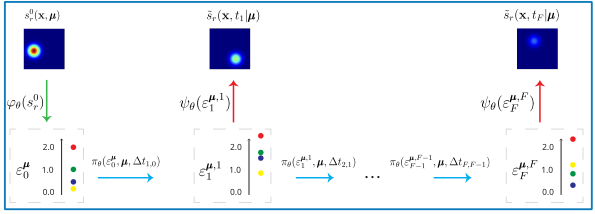

# Latent space modeling of parametric and time-dependent PDEs using neural ODEs

This repository contains the official implementation of the paper [*Latent space modeling of parametric and time-dependent PDEs using neural ODEs*](https://doi.org/10.1016/j.cma.2025.118394) (Computer Methods in Applied Mechanics and Engineering, 2026).

The method builds surrogate models for **parametrized**, **time-dependent** and (typically) **nonlinear** Partial Differential Equations (PDEs) by combining *dimensionality reduction* with *Neural ODEs*. The high-fidelity (high-dimensional) PDE solution is mapped to a low-dimensional latent space whose dynamics are governed by a latent Ordinary Differential Equation (ODE). Three components are approximated by neural networks:

1. an **Encoder** $\varphi_\theta$, which maps the high-dimensional PDE solution field to a low-dimensional latent vector;
2. a **Processor** $\pi_\theta$, which advances the latent vector in time by integrating the latent ODE with an explicit Runge–Kutta scheme;
3. a **Decoder** $\psi_\theta$, which maps a latent vector back to the corresponding high-dimensional PDE solution field.

At inference time, the initial condition $s_r^0$ is encoded into its latent representation $\varepsilon_{\pmb{\mu}}^0$. The latent trajectory $\varepsilon_{\pmb{\mu}}^1, \varepsilon_{\pmb{\mu}}^2, \ldots$ is then computed autoregressively by repeated application of the Processor, and each latent vector is decoded to recover the corresponding PDE solution.

## Installation

```bash
git clone git@github.com:Aleartulon/AE_NODE.git
cd AE_NODE

conda env create -f environment.yml
conda activate artu
```

> [!NOTE]
> Depending on your platform, conda may resolve a CPU-only build of PyTorch. Training falls back to the CPU silently if CUDA is unavailable, so check with `python -c "import torch; print(torch.cuda.is_available())"` and, if needed, install a CUDA-enabled build following the [PyTorch instructions](https://pytorch.org/get-started/locally/).

## Data format

Training and validation data are read from four NumPy files in the directory given by `data_path` in `configs/initial_information.yaml`. The file names are set by `name_training_field`, `name_validation_field`, `name_training_parameter` and `name_validation_parameter` (by default `field_training.npy`, `field_validation.npy`, `parameter_training.npy`, `parameter_validation.npy`).

| File | Shape |
| --- | --- |
| training field | $[N_{tr}, T, C, X_1, \ldots, X_d]$ |
| validation field | $[N_{val}, T, C, X_1, \ldots, X_d]$ |
| training parameters | $[N_{tr}, T, N_\mu + 1]$ &nbsp; (or $[N_{tr}, T]$ if $N_\mu = 0$) |
| validation parameters | $[N_{val}, T, N_\mu + 1]$ &nbsp; (or $[N_{val}, T]$ if $N_\mu = 0$) |

where

- $N_{tr}$ and $N_{val}$ are the numbers of training and validation trajectories;
- $T$ is the number of time steps in each trajectory;
- $C$ is the number of channels of the solution field (1 for a scalar field);
- $X_1, \ldots, X_d$ are the grid sizes of the $d \in \{1, 2\}$ spatial dimensions. All spatial dimensions must have the same size, `side_size`, and it must be divisible by $2^n$, where $n$ is the number of stride-2 layers in the Encoder;
- $N_\mu$ is the number of PDE parameters (`dim_parameter`).

For every trajectory and time step, the parameter file stores the $N_\mu$ PDE parameters followed by the time step $\Delta t$ used to advance the solution from step $i$ to step $i+1$. The time step is always the last entry. If the PDE has no parameters, the file contains only $\Delta t$.

## Usage

Training is configured by two YAML files and must be launched from the repository root:

- [configs/initial_information.yaml](configs/initial_information.yaml): data, training and optimization settings;
- [configs/model_information.yaml](configs/model_information.yaml): network architecture.

Every entry is documented by an inline comment. At minimum, set `data_path`, `dim_input`, `side_size`, `dim_parameter` and `which_device` for your problem, then run

```bash
python bin/main.py
```

### Training modes

The `is_coupled` entry selects which components are trained:

| `is_coupled` | Behaviour |
| --- | --- |
| `[true, ...]` | Encoder, Processor and Decoder are trained jointly (second entry ignored). |
| `[false, 'AE']` | Only the autoencoder is trained. |
| `[false, 'NODE']` | The autoencoder is loaded from `path_trained_AE` and frozen; only the latent dynamics are trained. |

When `is_coupled[0]` is `false`, the loss weights `loss_coeff_not_coupled` are used instead of `loss_coeff_TF_AR_together`.

### Outputs

Each run writes its results to `<physics_model>/Models/<description>/`:

```plaintext
<physics_model>/Models/<description>/
├── checkpoint/check.pt   # weights of the best validation epoch (used to resume with `checkpoint: true`)
├── losses/               # per-epoch training and validation losses (.npy)
├── Normalization.csv     # minima/maxima used to normalize fields and parameters
└── scripts/              # copy of the code and configs used for the run
```

Re-running with the same `physics_model` and `description` overwrites the previous results.

### Inference

[src/test/testing_pipeline.ipynb](src/test/testing_pipeline.ipynb) loads a trained model and rolls it out from given initial conditions and PDE parameters. Set the path to the trained model and to the test data in the notebook before running it.

## Example: Burgers' equation

[examples_datasets/burgers_0.001/](examples_datasets/burgers_0.001/) contains the configuration used for the Burgers' equation with $\nu = 0.001$. To reproduce it, copy both files into [configs/](configs/), set `data_path` to the directory containing your data (see [Data format](#data-format)), and start training:

```bash
cp examples_datasets/burgers_0.001/*.yaml configs/
python bin/main.py
```

## Repository structure

```plaintext
├── bin/main.py           # training entry point
├── configs/              # active configuration read by bin/main.py
├── examples_datasets/    # example configurations
├── images/               # figures
└── src/
    ├── architecture.py                  # Encoder, Decoder and latent dynamics networks
    ├── data_functions.py                # dataset loading and normalization
    ├── method_functions.py              # Runge–Kutta processor and loss functions
    ├── training_validation_functions.py # training and validation loops
    └── test/testing_pipeline.ipynb      # inference notebook
```

## Citation

If you use this code in your research, please cite:

```bibtex
@article{longhi2026latent,
  title   = {Latent space modeling of parametric and time-dependent {PDEs} using neural {ODEs}},
  author  = {Longhi, Alessandro and Lathouwers, Danny and Perk{\'o}, Zolt{\'a}n},
  journal = {Computer Methods in Applied Mechanics and Engineering},
  volume  = {448},
  pages   = {118394},
  year    = {2026},
  doi     = {10.1016/j.cma.2025.118394}
}
```

A preprint is available on [arXiv:2502.08683](https://arxiv.org/abs/2502.08683).

## Contact

For questions, please contact Alessandro Longhi at [a.longhi@tudelft.nl](mailto:a.longhi@tudelft.nl).
